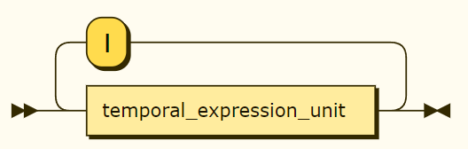

# 🕒 Fuzzy Dates

A comprehensive EBNF (Extended Backus-Naur Form) grammar for representing fuzzy, uncertain, and complex temporal expressions. This grammar provides a standardized way to express dates and times with various levels of precision, uncertainty, and contextual information.

## 📝 Introduction

The Fuzzy Dates grammar is designed to solve the problem of representing temporal information that is not exact or precise. It's particularly useful in scenarios where:

* Historical records have uncertain dates
* Archaeological findings need temporal context
* Scientific data includes temporal uncertainty
* Business requirements need flexible date ranges
* Cultural or calendar system differences need to be represented

### What is EBNF?

EBNF (Extended Backus-Naur Form) is a notation for formally describing syntax. It's commonly used to define the grammar of programming languages, data formats, and other formal languages. The EBNF file in this repository defines the syntax rules for expressing fuzzy dates in a standardized way.

### How to Use

Use the [grammar/fuzzy-date.ebnf](grammar/fuzzy-date.ebnf) file to implement a parser in your preferred programming language.

1. **Parser Implementation**: Use the EBNF grammar to implement a parser in your preferred programming language
2. **Database Storage**: Define database schemas that can store fuzzy date expressions
3. **Testing**: Use the examples provided to test your implementation
4. **Integration**: Integrate the parser into your application for handling fuzzy date inputs

## 📚 EBNF file

https://github.com/dariusz-wozniak/fuzzy-dates/blob/dda6ec2945b3ff63f153c9259ce47acb0253d3eb/grammar/fuzzy-date.ebnf#L1-L188

## ✨ Features Overview

* Standard Dates — e.g. `1990-05-01`
* Approximate Dates (`~`) — e.g. `~1990`
* Partial Dates (`?`) — e.g. `2025-04-?`
* Time-Only Expressions (`T`) — e.g. `T12:00:00`
* Time-Only Expressions With High Precision — e.g. `2023-11-20T23:59:59.123456789`
* Seasons (`Season-YYYY`) — e.g. `Autumn-2023`
* Periodic Dates (`D`, `W`, `Q`, `H`) — e.g. `D12-2022`
* Centuries (`C`) - e.g. `19C`
* Decades (`YYYYs`) - e.g. `1970s`
* Temporal Qualifiers (`Early-`, `Mid-`, `Late-`) — e.g. `Early-2020`
* Notes and Annotations — e.g. `1985-12-17T08:45:00+02:00#birth of author`
* Geo-Temporal Qualifiers — e.g. `2023-06-15@Tokyo`
* Geo-Temporal Qualifiers With Coordinates — e.g. `2023-06-15T12:00:00@geo:50.061389,19.937222`
* Historical Style Notes — e.g. `1700-03-20(os)`
* Calendar Systems — e.g. `1700-03-20(julian)`
* Ranges and Open-ended Ranges — e.g. `2000..2010`
* Multiple Choices — e.g. `1980-01-01..1981-12-31|1990-01..1992-06`
* Day & Month Choices/Ranges — e.g. `2012-12-[1..3]`
* Uncertainty Expressions — e.g. `2014(±2y)`
* Nested Uncertainty — e.g. `~2023(±1y)(±0.5Q)`
* Ordinal Day-of-Week Expressions — e.g. `1º-Mon-2022`
* Weighted Date Part Choices — e.g. `2020-[03*20%-04*80%]`
* Probability Distributions — e.g. `2023~normal(μ=2023,σ=2)`
* Temporal Integer Choices — e.g. `2023-[03..05]`
* Timezone Handling — e.g. `2024-01-01T00:00:00[America/New_York]`
* Timezone Shifts — e.g. `2024-01-01T00:00:00[EST→EDT]`
* Number Separators — e.g. `1_000_000`

## 🔄 SPARQL Integration

The Fuzzy Dates grammar can be integrated with SPARQL queries to handle temporal data with uncertainty. Here's how you can use it:

### Basic Integration

```sparql
PREFIX xsd: <http://www.w3.org/2001/XMLSchema#>
PREFIX fuzzy: <http://example.org/fuzzy-dates#>

# Example query using fuzzy date expressions
SELECT ?event ?date
WHERE {
  ?event fuzzy:date ?date .
  FILTER(fuzzy:matches(?date, "~2020(±2y)"))
}
```

### Key Features for SPARQL

1. **Custom Functions**
   - `fuzzy:matches(date, pattern)` - Matches a date against a fuzzy date pattern
   - `fuzzy:overlaps(date1, date2)` - Checks if two fuzzy dates overlap
   - `fuzzy:contains(date, subdate)` - Checks if one fuzzy date contains another

2. **Temporal Reasoning**
   ```sparql
   # Find events that occurred during a specific period
   SELECT ?event
   WHERE {
     ?event fuzzy:date ?date .
     FILTER(fuzzy:overlaps(?date, "2020-2025"))
   }
   ```

3. **Uncertainty Handling**
   ```sparql
   # Find events with specific uncertainty levels
   SELECT ?event
   WHERE {
     ?event fuzzy:date ?date .
     FILTER(fuzzy:matches(?date, "2020(±1y)"))
   }
   ```

4. **Complex Temporal Queries**
   ```sparql
   # Find events in a specific season with uncertainty
   SELECT ?event
   WHERE {
     ?event fuzzy:date ?date .
     FILTER(fuzzy:matches(?date, "Summer-2023(±1m)"))
   }
   ```

### Implementation Notes

1. **Parser Integration**
   - Implement the EBNF grammar parser as a SPARQL extension
   - Register custom functions with your SPARQL engine

2. **Performance Considerations**
   - Index fuzzy date expressions for efficient querying
   - Use appropriate data types for storage
   - Consider caching frequently used patterns

3. **Best Practices**
   - Use consistent date formats across your dataset
   - Document your fuzzy date patterns
   - Include uncertainty information when available

## 📃 Docs

* [Features](docs/features.md)
* [Syntax Diagram](docs/diagram.md)
* [Versions](docs/versions.md)

## 💡 What's next? Ideas

For future work, would be nice to have a py/js parser + a lovely test coverage.

As for the syntax, ideas for EBNF (not planned as for now though :):

* Relative Dates, `1980-01-01 + 5y 3m 2d`, `2023-10-01..+P6M`
    * Relative Dates for business days, `2023-01-01 + 5bd`
    * Relative Dates for holidays, `2023-01-01 + 5hd`
    * Relative Dates for weekends, `2023-01-01 + 5wd`
    * Relative Dates for fiscal periods, `2023-01-01 + 5fp`
    * Relative Dates for academic periods, `2023-01-01 + 5ap`
* Seasonal References, `Next-Summer`, `Last-Winter`
* Timeline based
    * Time-based language parsed, `today`, `lastWeek`
    * Time-line based, `past`, `future`, `now`
    * Relative to now, `justNow`, `momentAgo`, `nearFuture`, `farFuture`
    * Past references, `recentPast`, `distantPast`
* Time Spans, `lifetime`, `generation`
* Support Millenia, `1mil`
* Contextual Seasons, `Summer[astronomical]-2022`, `Summer[solar]-2022`
* Recurring / Cyclical Dates, `R:Yearly-12-25`, `R:Weekly-Wed`, `R:Weekly-Mon-Fri-except(2023-01-01)-for(1y)`
* Time Intervals (Duration + Start/End), `P3y6m2d`, `2023-01-01/P1y`, `P3[LunarMonth]`
* Fuzzy Relative Time References, `~Soon`, `~LongAgo`, `~Recently`
* Event-Based References, `@WW2:End + 1y`, `@MoonLanding`, `@PersonX:Birth`
* Era-Based References, `JurassicPeriod`, `IronAge`, `MiddleAges`, `VictorianEra`, `WWII`, `InformationAge`
* Fuzzy Anchors, `JurassicPeriod..MiddleAges`, `WWII..`
* Cultural Variations, `2023-01-01(en-US)`, `2023-01-01(pl-PL)`
* Culture/Religious-events based, `Easter(2023)`, `Christmas(2023)`, `ChineseNewYear(2023)`
* Contextual Modifiers, `BusinessDays(2023-12-20..2023-12-31)`, `Weekends(2023-05)`, `Holidays(US, 2023)`
* Mathematical Operations on Dates, `Avg(2023-01-01, 2023-12-31)`, `2023-01-01 + (2023-12-31 - 2023-01-01)/2`, `Union(2023-01-01,2023-12-31)`
* Linguistic Approximations, `~FewYearsAgo`, `~LastCentury`
* Date Element Comments and Citations, `1237-03-[19|20|21|22|23#('Most 13th-century sources suggest that John died between 19 and 23 March 1237')]`, `~1170#('uncertain birth year')`
* Versioning for Date Definitions, `@MoonLanding{v2}`
* Bidirectional Indefiniteness ("between-ish"), `2022~between~2025`, `2022*70%~2025`
* Unspecified digit(s), `201X-05-XX`
* Exponential year, `17E8`
* Date Element Specifier, `M12`, `D31`, `Y2000`
* Set Representation
* Approximate Qualification, `2012-01-~12`
* Temporal categories:
    * Temporal Logic, `Before(date1, date2)`, `During(date, period)`
    * Temporal Aggregation, `GroupBy(dates, period)`, `Cluster(dates, maxGap)`
    * Temporal Validation, `IsValid(date, constraints)`, `IsConsistent(dates)`
    * Temporal Transformation, `Convert(date, targetCalendar)`, `Normalize(date, format)`
* Connect with External Data (e.g. Wikidata)
* ISO 8061 full compatibility
