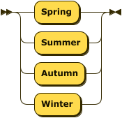
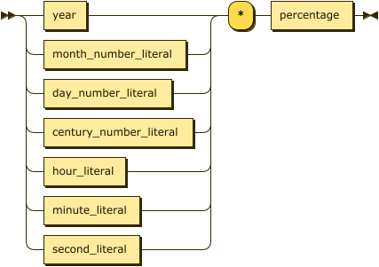
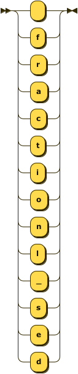
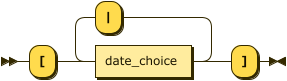

[Version: 2025-06-17_1](versions.md)

**fuzzy_date_expression:**


```
fuzzy_date_expression
         ::= temporal_expression_unit ( '|' temporal_expression_unit )*
```

**temporal_expression_unit:**


```
temporal_expression_unit
         ::= date_expr
           | time_only_expr
           | century_expr
           | decade_expr
           | numeric_timeline_point
           | day_of_year_expr
           | week_expr
           | quarter_expr
           | half_year_expr
           | ordinal_day_expr
           | range_expr
           | partial_date_expr
```

referenced by:

* fuzzy_date_expression

**range_expr:**


```
range_expr
         ::= temporal_expression_boundary '..' temporal_expression_boundary
```

referenced by:

* temporal_expression_unit

**temporal_expression_boundary:**


```
temporal_expression_boundary
         ::= date_expr
           | century_expr
           | decade_expr
           | day_of_year_expr
           | week_expr
           | quarter_expr
           | half_year_expr
           | ordinal_day_expr
           | ''
           | '?'
```

referenced by:

* range_expr

**temporal_qualifier:**


```
temporal_qualifier
         ::= 'Early'
           | 'Mid'
           | 'Late'
```

**uncertainty:**


```
uncertainty
         ::= '(' uncertainty_content ')'
```

**uncertainty_content:**


```
uncertainty_content
         ::= uncertainty_symmetric
           | uncertainty_asymmetric
           | distribution_details
```

referenced by:

* uncertainty

**uncertainty_symmetric:**


```
uncertainty_symmetric
         ::= '±' number [uncertaiy_]
```

referenced by:

* uncertainty_content

**uncertainty_asymmetric:**


```
uncertainty_asymmetric
         ::= '+' number [uncertaiy_] '-' number [uncertaiy_]
```

referenced by:

* uncertainty_content

**uncertainty_unit:**


```
uncertainty_unit
         ::= 'y'
           | 'Q'
           | 'm'
           | 'd'
           | 'h'
           | 'min'
           | 's'
```

**distribution_details:**


```
distribution_details
         ::= distribution_name '(' distribution_param_list ')'
```

referenced by:

* uncertainty_content

**distribution_name:**


```
distribution_name
         ::= 'normal'
           | 'uniform'
           | 'triangular'
```

referenced by:

* distribution_details

**distribution_param_list:**


```
distribution_param_list
         ::= distribution_param ( ',' distribution_param )*
```

referenced by:

* distribution_details

**distribution_param:**


```
distribution_param
         ::= label '=' ( number | date_expr )
```

referenced by:

* distribution_param_list

**label:**


```
label    ::= ( letter | digit | '_' )+
```

referenced by:

* distribution_param

**date_expr:**


```
date_expr
         ::= [ '~] [ temporal_quif'-'] date_prefix [uncertaiy]* [ time_copn] [ timezon_cp] [ geo_qualifr] [ note_cmp] [ style_no] [
                  calendr_sytm]
```

referenced by:

* distribution_param
* temporal_expression_boundary
* temporal_expression_unit

**partial_date_expr:**


```
partial_date_expr
         ::= '?' '-' ( month_component | '?' '-' day_component ) [ time_copn] [ geo_qualifr] [ note_cmp] [ style_no] [ calendr_sytm]
```

referenced by:

* temporal_expression_unit

**date_prefix:**


```
date_prefix
         ::= year [ '-'month_cpe] [ '-'day_compnet]
           | season_name '-' year
```

referenced by:

* date_expr
* ordinal_temporal_period_reference

**season_name:**



```
season_name
         ::= 'Spring'
           | 'Summer'
           | 'Autumn'
           | 'Winter'
```

referenced by:

* date_prefix

**century_expr:**


```
century_expr
         ::= [ '~] [ temporal_quif'-'] century_number 'C' [uncertaiy]* [ style_no] [ calendr_sytm]
```

referenced by:

* ordinal_temporal_period_reference
* temporal_expression_boundary
* temporal_expression_unit

**century_number:**


```
century_number
         ::= integer_number
           | temporal_integer_choice
```

referenced by:

* century_expr

**decade_expr:**


```
decade_expr
         ::= [ '~] [ temporal_quif'-'] decade_number 's' [uncertaiy]* [ style_no] [ calendr_sytm]
```

referenced by:

* ordinal_temporal_period_reference
* temporal_expression_boundary
* temporal_expression_unit

**decade_number:**


```
decade_number
         ::= digit digit digit
```

referenced by:

* decade_expr

**day_of_year_expr:**


```
day_of_year_expr
         ::= [ '~] 'D' day_number_in_year '-' year [uncertaiy]* [ note_cmp] [ style_no] [ calendr_sytm]
```

referenced by:

* temporal_expression_boundary
* temporal_expression_unit

**day_number_in_year:**


```
day_number_in_year
         ::= digit [ digt] [ digt]
```

referenced by:

* day_of_year_expr

**week_expr:**


```
week_expr
         ::= [ '~] [ temporal_quif'-'] 'W' digit digit '-' year [ '-''D-'day_ofweknumbrpic] [uncertaiy]* [ note_cmp] [ style_no] [ calendr_sytm]
```

referenced by:

* ordinal_temporal_period_reference
* temporal_expression_boundary
* temporal_expression_unit

**quarter_expr:**


```
quarter_expr
         ::= [ '~] [ temporal_quif'-'] 'Q' ( '1' | '2' | '3' | '4' ) '-' year [uncertaiy]* [ note_cmp] [ style_no] [ calendr_sytm]
```

referenced by:

* ordinal_temporal_period_reference
* temporal_expression_boundary
* temporal_expression_unit

**half_year_expr:**


```
half_year_expr
         ::= [ '~] [ temporal_quif'-'] 'H' ( '1' | '2' ) '-' year [uncertaiy]* [ note_cmp] [ style_no] [ calendr_sytm]
```

referenced by:

* ordinal_temporal_period_reference
* temporal_expression_boundary
* temporal_expression_unit

**ordinal_day_expr:**


```
ordinal_day_expr
         ::= [ '~] ( ordinal_day_single | ordinal_day_range ) [uncertaiy]* [ note_cmp] [ style_no] [ calendr_sytm]
```

referenced by:

* temporal_expression_boundary
* temporal_expression_unit

**ordinal_day_single:**


```
ordinal_day_single
         ::= ordinal_number '-' day_of_week_short '-' ordinal_temporal_period_reference
```

referenced by:

* ordinal_day_expr

**ordinal_day_range:**


```
ordinal_day_range
         ::= '[' ordinal_number '..' ordinal_number ']' '-' day_of_week_short '-' ordinal_temporal_period_reference
```

referenced by:

* ordinal_day_expr

**ordinal_number:**


```
ordinal_number
         ::= digit+ 'º'
```

referenced by:

* ordinal_day_range
* ordinal_day_single

**day_of_week_short:**


```
day_of_week_short
         ::= 'Mon'
           | 'Tue'
           | 'Wed'
           | 'Thu'
           | 'Fri'
           | 'Sat'
           | 'Sun'
```

referenced by:

* ordinal_day_range
* ordinal_day_single

**day_of_week_number_periodic:**


```
day_of_week_number_periodic
         ::= '1'
           | '2'
           | '3'
           | '4'
           | '5'
           | '6'
           | '7'
```

**ordinal_temporal_period_reference:**


```
ordinal_temporal_period_reference
         ::= year
           | date_prefix
           | decade_expr
           | century_expr
           | week_expr
           | quarter_expr
           | half_year_expr
```

referenced by:

* ordinal_day_range
* ordinal_day_single

**numeric_timeline_point:**


```
numeric_timeline_point
         ::= [ '~] number [uncertaiy]* [ note_cmp]
```

referenced by:

* temporal_expression_unit

**time_only_expr:**


```
time_only_expr
         ::= 'T' time_component [ timezon_cp] [ geo_qualifr] [ note_cmp] [ style_no] [ calendr_sytm]
```

referenced by:

* temporal_expression_unit

**geo_qualifier:**


```
geo_qualifier
         ::= '@' ( location_name | geo_coordinates )
```

**location_name:**


```
location_name
         ::= character_in_location_name+
```

referenced by:

* geo_qualifier

**character_in_location_name:**


```
character_in_location_name
         ::= letter
           | digit
           | ' '
           | '/'
           | '-'
           | '_'
```

referenced by:

* location_name

**geo_coordinates:**


```
geo_coordinates
         ::= 'geo:' number ',' number
```

referenced by:

* geo_qualifier

**weighted_date_part:**



```
weighted_date_part
         ::= ( year | month_number_literal | day_number_literal | century_number_literal | hour_literal | minute_literal | second_literal ) '*' percentage
```

referenced by:

* weighted_date_part_choice

**weighted_date_part_choice:**


```
weighted_date_part_choice
         ::= '[' weighted_date_part ( '-' weighted_date_part )* ']'
```

referenced by:

* day_component
* hour_component
* minute_component
* month_component
* second_component

**temporal_integer_choice:**


```
temporal_integer_choice
         ::= '[' ( integer_range | integer_discrete ) ']'
```

referenced by:

* century_number
* day_component
* hour_component
* minute_component
* month_component
* second_component
* year

**integer_range:**


```
integer_range
         ::= integer_number '..' integer_number
```

referenced by:

* temporal_integer_choice

**integer_discrete:**


```
integer_discrete
         ::= integer_number ( '|' integer_number )*
```

referenced by:

* temporal_integer_choice

**month_number_literal:**


```
month_number_literal
         ::= '0' ( '1' | '2' | '3' | '4' | '5' | '6' | '7' | '8' | '9' )
           | '1' ( '0' | '1' | '2' )
```

referenced by:

* date_pair
* month_component
* weighted_date_part

**month_component:**


```
month_component
         ::= month_number_literal
           | '?'
           | weighted_date_part_choice
           | multi_date_choice
           | temporal_integer_choice
```

referenced by:

* partial_date_expr

**day_number_literal:**


```
day_number_literal
         ::= '0' ( '1' | '2' | '3' | '4' | '5' | '6' | '7' | '8' | '9' )
           | ( '1' | '2' ) digit
           | '3' ( '0' | '1' )
```

referenced by:

* date_pair
* day_component
* day_number_or_wildcard
* day_range
* weighted_date_part

**day_component:**


```
day_component
         ::= day_number_literal
           | '?'
           | day_choice_component
           | weighted_date_part_choice
           | temporal_integer_choice
```

referenced by:

* partial_date_expr

**time_component:**


```
time_component
         ::= hour_component ':' minute_component [ ':second_mptfrail]
```

referenced by:

* time_only_expr

**fractional_seconds_opt:**



```
fractional_seconds_opt
         ::= [ fractionl_sed]
```

**hour_literal:**


```
hour_literal
         ::= ( '0' | '1' ) digit
           | '2' ( '0' | '1' | '2' | '3' )
```

referenced by:

* hour_component
* weighted_date_part

**hour_component:**


```
hour_component
         ::= hour_literal
           | '?'
           | weighted_date_part_choice
           | temporal_integer_choice
```

referenced by:

* time_component

**minute_literal:**


```
minute_literal
         ::= ( '0' | '1' | '2' ( '3' | '4' | '5' ) ) digit
```

referenced by:

* minute_component
* weighted_date_part

**minute_component:**


```
minute_component
         ::= minute_literal
           | '?'
           | weighted_date_part_choice
           | temporal_integer_choice
```

referenced by:

* time_component

**second_literal:**


```
second_literal
         ::= ( '0' | '1' | '2' ( '3' | '4' | '5' ) ) digit
```

referenced by:

* second_component
* weighted_date_part

**second_component:**


```
second_component
         ::= second_literal
           | '?'
           | weighted_date_part_choice
           | temporal_integer_choice
```

**fractional_seconds:**


```
fractional_seconds
         ::= '.' digit+
```

**timezone_component:**


```
timezone_component
         ::= 'Z'
           | ( '+' | '-' ) tz_hour ':' tz_minute
           | letter letter letter
           | '[' ( timezone_full_id | timezone_transition ) ']'
```

**timezone_full_id:**


```
timezone_full_id
         ::= character_in_timezone_id+
```

referenced by:

* timezone_component
* timezone_transition

**character_in_timezone_id:**


```
character_in_timezone_id
         ::= letter
           | digit
           | '_'
           | '/'
           | '+'
           | '-'
```

referenced by:

* timezone_full_id

**timezone_transition:**


```
timezone_transition
         ::= timezone_full_id '→' timezone_full_id
```

referenced by:

* timezone_component

**note_component:**


```
note_component
         ::= '#' character*
```

**style_note:**


```
style_note
         ::= 'os'
           | 'ns'
```

**calendar_system:**


```
calendar_system
         ::= '(' calendar_id ')'
```

**calendar_id:**


```
calendar_id
         ::= character_in_calendar_id+
```

referenced by:

* calendar_system

**character_in_calendar_id:**


```
character_in_calendar_id
         ::= [^)\n]
```

referenced by:

* calendar_id

**multi_date_choice:**



```
multi_date_choice
         ::= '[' date_choice ( '|' date_choice )* ']'
```

referenced by:

* month_component

**date_choice:**


```
date_choice
         ::= date_pair
           | day_range
```

referenced by:

* multi_date_choice

**date_pair:**


```
date_pair
         ::= month_number_literal '-' day_number_literal
```

referenced by:

* date_choice

**day_range:**


```
day_range
         ::= day_number_literal '..' [ '~] day_number_or_wildcard
```

referenced by:

* date_choice

**day_number_or_wildcard:**


```
day_number_or_wildcard
         ::= day_number_literal
           | '?'
```

referenced by:

* day_range

**year:**


```
year     ::= integer_number
           | '?'
           | temporal_integer_choice
```

referenced by:

* date_prefix
* day_of_year_expr
* half_year_expr
* ordinal_temporal_period_reference
* quarter_expr
* week_expr
* weighted_date_part

**century_number_literal:**


```
century_number_literal
         ::= digit+
```

referenced by:

* weighted_date_part

**integer_number:**


```
integer_number
         ::= [ '-'] digit+
```

referenced by:

* century_number
* integer_discrete
* integer_range
* year

**percentage:**


```
percentage
         ::= '100%'
           | digit digit '%'
```

referenced by:

* weighted_date_part

**number:**


```
number   ::= [ '-'] digit+ [ '.digt+]
```

referenced by:

* distribution_param
* geo_coordinates
* numeric_timeline_point
* uncertainty_asymmetric
* uncertainty_symmetric

**digit:**


```
digit    ::= '0'
           | '1'
           | '2'
           | '3'
           | '4'
           | '5'
           | '6'
           | '7'
           | '8'
           | '9'
```

referenced by:

* century_number_literal
* character_in_location_name
* character_in_timezone_id
* day_number_in_year
* day_number_literal
* decade_number
* fractional_seconds
* hour_literal
* integer_number
* label
* minute_literal
* number
* ordinal_number
* percentage
* second_literal
* week_expr

**letter:**


```
letter   ::= 'A' . . 'Z'
```

referenced by:

* character_in_location_name
* character_in_timezone_id
* label
* timezone_component

**character:**


```
character
         ::= [^\n]
```

referenced by:

* note_component

## 
 <sup>generated by [RR - Railroad Diagram Generator][RR]</sup>

[RR]: https://www.bottlecaps.de/rr/ui
